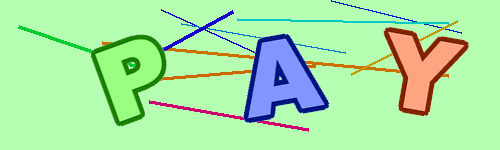
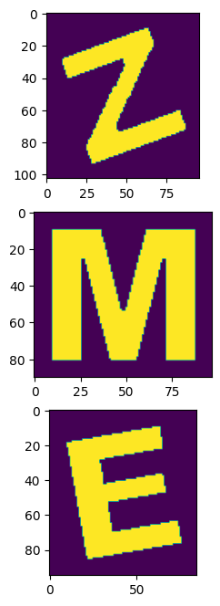
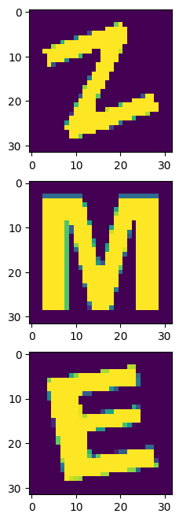

# DeCaptcha

## Installation

Run `install.sh`

## Approach

You're provided a set of captcha-like pictures but of much simpler format, example as  


- Convert the Matrix to HSV, and pick out the 4 most common (Saturation, Value) value pairs. CLAIM: the most common tuple is for the background, and the next 3 are for the letters. Assuming that all of the next 3 tuples are the same (i.e. (Saturation, Value) value pairs for all 3 letters are the same).
- Use the above tuple to create a mask for a file, filtering out ONLY the letters from the image. Now you'll have an grayscale image containing all 3 letters with values near 255, and background exactly 0.
- Use Islanding concept and caching, to seperate out all 3 letters. allot them 3 different values, and mask them out individually.
- Obtaining individual cropped image set:  
 
- Now normalise the image, and pass it to a model. Model chosen is:

```py
Model: "sequential_11"
_________________________________________________________________
 Layer (type)                Output Shape              Param #   
=================================================================
 conv2d_20 (Conv2D)          (None, 13, 13, 7)         70        
                                                                 
 max_pooling2d_11 (MaxPoolin  (None, 6, 6, 7)          0         
 g2D)                                                            
                                                                 
 flatten_11 (Flatten)        (None, 252)               0         
                                                                 
 dense_11 (Dense)            (None, 24)                6072      
                                                                 
=================================================================
Total params: 6,142
Trainable params: 6,142
Non-trainable params: 0
_________________________________________________________________
```

## Execution

Run `predict.py` to use the [model](./models/model.h5) and adjust [parameters](./params.py) to get the result.
